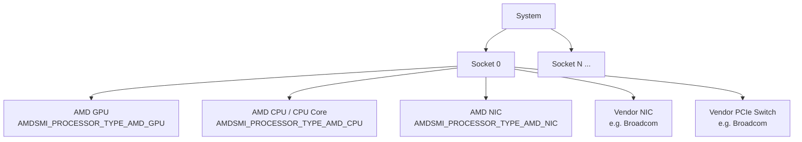
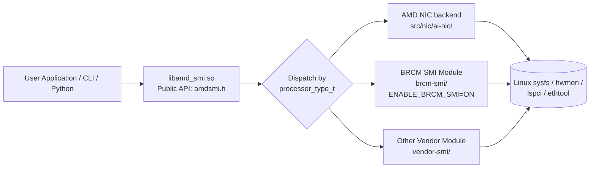

<!--
  Copyright (c) Advanced Micro Devices, Inc. All rights reserved.

  Permission is hereby granted, free of charge, to any person obtaining a copy
  of this software and associated documentation files (the "Software"), to deal
  in the Software without restriction, including without limitation the rights
  to use, copy, modify, merge, publish, distribute, sublicense, and/or sell
  copies of the Software, and to permit persons to whom the Software is
  furnished to do so, subject to the following conditions:

  The above copyright notice and this permission notice shall be included in
  all copies or substantial portions of the Software.

  THE SOFTWARE IS PROVIDED "AS IS", WITHOUT WARRANTY OF ANY KIND, EXPRESS OR
  IMPLIED, INCLUDING BUT NOT LIMITED TO THE WARRANTIES OF MERCHANTABILITY,
  FITNESS FOR A PARTICULAR PURPOSE AND NONINFRINGEMENT. IN NO EVENT SHALL THE
  AUTHORS OR COPYRIGHT HOLDERS BE LIABLE FOR ANY CLAIM, DAMAGES OR OTHER
  LIABILITY, WHETHER IN AN ACTION OF CONTRACT, TORT OR OTHERWISE, ARISING FROM,
  OUT OF OR IN CONNECTION WITH THE SOFTWARE OR THE USE OR OTHER DEALINGS IN
  THE SOFTWARE.
-->

# AMD SMI NIC and PCIe Switch Integration Guide

## Overview

This document describes the AMD SMI public APIs, data structures, interfaces, and conventions for integrating Network Interface Card (NIC) and PCIe switch device support into the [AMD SMI](https://github.com/ROCm/rocm-systems/tree/develop/projects/amdsmi) framework. It serves as a reference for external contributors and device vendors who wish to add or extend support for new NIC or PCIe switch hardware within AMD SMI.

The APIs, conventions, and integration patterns described here apply to **both** supported AMD SMI deployment modes:

- **Bare-metal (BM) under ROCm** — host-side use of AMD SMI on a system with directly-attached AMD accelerators, NICs, and PCIe switches.
- **Host AMD SMI (virtualization host)** — AMD SMI running on a hypervisor host that manages AMD devices passed through to guests.

Where the deployment surface differs (build flags, discovery, feature availability), the difference is called out inline. For repositories and public documentation for both surfaces, see the [Appendix: Environment and Build](#appendix-environment-and-build).

AMD SMI provides a unified management interface for AMD accelerators (GPUs, CPUs), and is extended to support NIC and PCIe switch devices via its public C API. This document covers:

- Architecture and device model
- Public API conventions and naming
- Data structures and type definitions
- Device discovery and initialization
- NIC Information APIs (ASIC, bus, NUMA, ports, RDMA, statistics)
- NIC hwmon sensors (temperature, power, voltage — extensible)
- NIC port and PCIe switch PCI-level metrics
- PCIe switch discovery and information
- Sysfs data source mapping
- Code organization and integration points
- Example usage (C and Python)
- Vendor SMI module integration pattern (with BRCM SMI as reference)
- CLI commands for NIC/Switch management
- Build configuration for vendor support

> **Note on API Status:** This document covers both **existing** (implemented and available)
> APIs and **proposed** (under design review, not yet implemented) APIs.
> Each section is clearly labeled. Proposed APIs are subject to change before finalization.

---

## Architecture

### Device Model

AMD SMI uses a hierarchical device model:

```
System
└── Socket(s)
    └── Processor(s)
        ├── GPU    (AMDSMI_PROCESSOR_TYPE_AMD_GPU)
        ├── CPU    (AMDSMI_PROCESSOR_TYPE_AMD_CPU / _AMD_CPU_CORE)
        ├── NIC    (AMDSMI_PROCESSOR_TYPE_AMD_NIC)
        └── Switch (vendor-specific processor type)
```

Vendor-specific processor types for third-party NICs and PCIe switches are also
supported and are assigned distinct `processor_type_t` identifiers during device
discovery (see the Processor Types section below).

Each NIC or PCIe switch is represented as a **processor handle** (`amdsmi_processor_handle`). Handles are obtained via the standard AMD SMI discovery APIs and are then passed to device-specific query functions.



### Processor Types

The `processor_type_t` enum defines all device types detectable by AMD SMI.
The values relevant to NIC and switch devices are:

```c
typedef enum {
    AMDSMI_PROCESSOR_TYPE_UNKNOWN = 0,   // Unknown processor type
    AMDSMI_PROCESSOR_TYPE_AMD_GPU,       // AMD GPU
    AMDSMI_PROCESSOR_TYPE_AMD_CPU,       // AMD CPU
    AMDSMI_PROCESSOR_TYPE_NON_AMD_GPU,   // Non-AMD GPU
    AMDSMI_PROCESSOR_TYPE_NON_AMD_CPU,   // Non-AMD CPU
    AMDSMI_PROCESSOR_TYPE_AMD_CPU_CORE,  // AMD CPU Core
    AMDSMI_PROCESSOR_TYPE_AMD_APU,       // AMD APU (GPU + CPU on a single die)
    AMDSMI_PROCESSOR_TYPE_AMD_NIC,       // AMD NIC (e.g., Pensando)
    // Additional vendor-specific NIC and PCIe switch types follow here
} processor_type_t;
```

Third-party NIC and PCIe switch vendors are assigned their own processor type
values appended to this enum, enabling the dispatch layer to route API calls
to the correct device implementation.

> **Note:** The type name is `processor_type_t` (not prefixed with `amdsmi_`).
> This is consistent with the current public header.

### Initialization Flags

To discover **AMD** NIC devices specifically, pass the `AMDSMI_INIT_AMD_NICS` flag during initialization:

```c
#define AMDSMI_INIT_AMD_NICS  (1 << 4)   // Initialize AMD NIC discovery only
```

> **Note:** `AMDSMI_INIT_AMD_NICS` only enables discovery of **AMD** NIC devices.
> NIC devices (AMD or vendor) can also be discovered by passing
> `AMDSMI_INIT_ALL_PROCESSORS`, or by OR'ing `AMDSMI_INIT_AMD_NICS` with other
> initialization flags (e.g., `AMDSMI_INIT_AMD_NICS | AMDSMI_INIT_AMD_GPUS`).
> Vendor NIC/switch modules (e.g., BRCM SMI) perform their own discovery when
> their respective build option is enabled (see [Vendor SMI Module Architecture](#vendor-smi-module-architecture)).

### Vendor SMI Module Architecture

Third-party vendors (e.g., Broadcom) can integrate their NIC/switch support via a
standalone **Vendor SMI Module** — a self-contained library that lives under a
dedicated directory (e.g., `brcm-smi/`) and is conditionally compiled into the
main `amd_smi` library.

**Module structure:**

```
<vendor>-smi/
├── include/<vendor>_smi/
│   ├── <vendor>smi.h            # Vendor's public C API header
│   └── impl/                    # Internal implementation headers
│       ├── <vendor>_smi_nic_device.h
│       ├── <vendor>_smi_switch_device.h
│       ├── <vendor>_smi_no_drm_nic.h
│       ├── <vendor>_smi_no_drm_switch.h
│       └── <vendor>_smi_discovery.h
├── src/
│   ├── <vendor>_smi.cc          # Core init/shutdown/discovery, getString
│   ├── <vendor>_smi_discovery.cc
│   ├── <vendor>_smi_nic_device.cc
│   ├── <vendor>_smi_switch_device.cc
│   ├── <vendor>_smi_no_drm_nic.cc
│   └── <vendor>_smi_no_drm_switch.cc
├── cmake/
│   └── <vendor>_smi_config.cmake.in
├── CMakeLists.txt
└── <VENDOR>_SMI_DOCUMENTATION.md
```

**Key design principles:**

1. **Compile-time flag**: Vendor modules are enabled via a CMake option
   (e.g., `ENABLE_BRCM_SMI=ON`). By default, vendor modules are OFF.

2. **Own type system**: Each vendor module defines its own types prefixed
   with the vendor name (e.g., `brcmsmi_status_t`, `brcmsmi_nic_info_t`,
   `brcmsmi_bdf_t`), independent of `amdsmi_*` types.

3. **AMD SMI wrapper layer**: Wrapper functions are added to `amdsmi.h` under
   `#ifdef ENABLE_<VENDOR>_SMI` that translate between AMD SMI types/status
   codes and the vendor's native types (see [BRCM SMI Integration APIs](#brcm-smi-integration-apis-in-amd-smi) below).

4. **Generic string retrieval**: Vendor modules expose a `<vendor>smi_getString()`
   function — a unified interface for retrieving string-based information from
   devices using method names (e.g., `"get_nic_info"`, `"get_switch_metrics"`).
   This enables flexible querying without adding a new API for every data point.

5. **Python interface**: Each vendor module provides its own Python ctypes
   wrapper (e.g., `brcmsmi_interface.py`) alongside updates to the AMD SMI
   Python interface (`amdsmi_interface.py`, `amdsmi_wrapper.py`).

6. **CLI delegation**: The AMD SMI CLI (`amdsmi_commands.py`) delegates
   vendor-specific NIC/switch commands to a `<Vendor>SMICommands` class
   (e.g., `BRCMSMICommands`), which is only instantiated when the vendor
   module is available.

### Building with Vendor SMI Support

To build AMD SMI with Broadcom NIC/Switch support:

```bash
mkdir build && cd build
cmake .. -DENABLE_BRCM_SMI=ON
make -j$(nproc)
```

When `ENABLE_BRCM_SMI=OFF` (the default), all BRCM-specific code is excluded
and the NIC/switch CLI commands will show:
```
ERROR | NIC monitoring requires BRCM SMI support. Please rebuild with -DENABLE_BRCM_SMI=ON
```

---

## Public API Conventions

### Naming

All public AMD SMI functions follow this pattern:

```
amdsmi_get_<device_type>_<data_category>(processor_handle, output_struct*)
```

Examples:
- `amdsmi_get_nic_asic_info()`
- `amdsmi_get_nic_bus_info()`
- `amdsmi_get_nic_port_info()`
- `amdsmi_get_nic_rdma_port_statistics()`

### Parameter Conventions

| Parameter | Convention |
|-----------|-----------|
| `processor_handle` | Always the first parameter. Obtained from discovery APIs. |
| Output structs | Pointer to user-allocated struct. Must not be NULL. |
| Two-call pattern | For variable-length data: first call with `data=NULL` returns count; second call fills array. |

### Return Values

All APIs return `amdsmi_status_t`:

| Status | Meaning |
|--------|---------|
| `AMDSMI_STATUS_SUCCESS` | Operation completed successfully |
| `AMDSMI_STATUS_INVAL` | Invalid argument (e.g., NULL pointer) |
| `AMDSMI_STATUS_NOT_SUPPORTED` | Feature not supported on this device |
| `AMDSMI_STATUS_FILE_ERROR` | Failed to read sysfs file |
| `AMDSMI_STATUS_NO_PERM` | Insufficient permissions |
| `AMDSMI_STATUS_INIT_ERROR` | Library not initialized |
| `AMDSMI_STATUS_BUSY` | Device mutex could not be acquired |

### Unsupported / Unavailable Fields

When a device or driver does not provide a value for a particular field within
a larger output struct, AMD SMI uses the following conventions instead of
failing the entire call:

| Field type | Sentinel value for unsupported / unavailable |
|------------|----------------------------------------------|
| Unsigned integers (`uint8_t`, `uint16_t`, `uint32_t`, `uint64_t`) | The maximum value of the type (e.g., `UINT32_MAX`, `UINT64_MAX`) |
| Signed integers | `INT32_MIN` / `INT64_MIN` |
| Floating-point | `NaN` |
| Strings (`char[]`) | The literal string `"N/A"`, or an empty string (`""`) when the field is structurally absent |
| Bitmask / flag fields | `0` (no flags set) |

Callers should treat these sentinel values as "not reported" and not as valid
data. The overall API call will still return `AMDSMI_STATUS_SUCCESS` provided
at least one field in the struct was populated; per-field availability is
encoded via the sentinels above. If *no* field can be populated, the API
returns `AMDSMI_STATUS_NOT_SUPPORTED`.

---

## Data Structures

### Size Constants

```c
#define AMDSMI_MAX_STRING_LENGTH       256  // Max string buffer length
#define AMDSMI_MAX_NIC_PORTS            32  // Max NIC ports
#define AMDSMI_MAX_NIC_RDMA_DEV         32  // Max RDMA devices
```

### NIC ASIC Information

```c
typedef struct {
    uint16_t vendor_id;
    uint16_t subvendor_id;
    uint16_t device_id;
    uint16_t subsystem_id;
    uint8_t  revision;
    char     permanent_address[AMDSMI_MAX_STRING_LENGTH];
    char     product_name[AMDSMI_MAX_STRING_LENGTH];
    char     part_number[AMDSMI_MAX_STRING_LENGTH];
    char     serial_number[AMDSMI_MAX_STRING_LENGTH];
    char     vendor_name[AMDSMI_MAX_STRING_LENGTH];
} amdsmi_nic_asic_info_t;
```

**Sysfs sources:**
- `vendor_id`: `/sys/bus/pci/devices/<BDF>/vendor`
- `device_id`: `/sys/bus/pci/devices/<BDF>/device`
- `subvendor_id`: `/sys/bus/pci/devices/<BDF>/subsystem_vendor`
- `subsystem_id`: `/sys/bus/pci/devices/<BDF>/subsystem_device`
- `revision`: `/sys/bus/pci/devices/<BDF>/revision`
- `product_name`, `part_number`, `serial_number`: VPD data, read from `/sys/bus/pci/devices/<BDF>/vpd` when present, with `lspci -vvv -s <BDF>` as a fallback for devices that do not expose the sysfs VPD entry.

### NIC Bus Information

```c
typedef struct {
    amdsmi_bdf_t bdf;
    uint8_t  max_pcie_width;
    uint32_t max_pcie_speed;  // in GT/s
    char     pcie_interface_version[AMDSMI_MAX_STRING_LENGTH];
    char     slot_type[AMDSMI_MAX_STRING_LENGTH];
} amdsmi_nic_bus_info_t;
```

**Sysfs sources:**
- `bdf`: Parsed from PCI enumeration
- `max_pcie_width`: `/sys/bus/pci/devices/<BDF>/max_link_width`
- `max_pcie_speed`: `/sys/bus/pci/devices/<BDF>/max_link_speed`

### BDF (Bus-Device-Function)

`amdsmi_bdf_t` is a union that provides three ways to access the BDF:

```c
typedef union {
    struct bdf_ {
        uint64_t function_number : 3;
        uint64_t device_number   : 5;
        uint64_t bus_number      : 8;
        uint64_t domain_number   : 48;
    } bdf;
    struct {  // anonymous access (same layout)
        uint64_t function_number : 3;
        uint64_t device_number   : 5;
        uint64_t bus_number      : 8;
        uint64_t domain_number   : 48;
    };
    uint64_t as_uint;  // raw 64-bit value
} amdsmi_bdf_t;
```

Fields can be accessed directly (e.g., `bdf.function_number`) or via the named
struct (e.g., `bdf.bdf.function_number`). The `as_uint` member provides the
packed 64-bit representation.

### NIC NUMA Information

```c
typedef struct {
    uint8_t node;
    char    affinity[AMDSMI_MAX_STRING_LENGTH];
} amdsmi_nic_numa_info_t;
```

**Sysfs sources:**
- `node`: `/sys/bus/pci/devices/<BDF>/numa_node`
- `affinity`: `/sys/devices/system/node/node<N>/cpulist` (where `<N>` is the value read from `numa_node`)

### NIC Port Information

```c
typedef struct {
    amdsmi_bdf_t bdf;
    uint32_t port_num;
    char     type[AMDSMI_MAX_STRING_LENGTH];
    char     flavour[AMDSMI_MAX_STRING_LENGTH];
    char     netdev[AMDSMI_MAX_STRING_LENGTH];
    uint8_t  ifindex;
    char     mac_address[AMDSMI_MAX_STRING_LENGTH];
    uint8_t  carrier;
    uint16_t mtu;
    char     link_state[AMDSMI_MAX_STRING_LENGTH];
    uint32_t link_speed;
    uint32_t active_fec;   // Active FEC modes bitmask
    char     autoneg[AMDSMI_MAX_STRING_LENGTH];
    char     pause_autoneg[AMDSMI_MAX_STRING_LENGTH];
    char     pause_rx[AMDSMI_MAX_STRING_LENGTH];
    char     pause_tx[AMDSMI_MAX_STRING_LENGTH];
} amdsmi_nic_port_t;

typedef struct {
    uint32_t        num_ports;
    amdsmi_nic_port_t ports[AMDSMI_MAX_NIC_PORTS];
} amdsmi_nic_port_info_t;
```

**Active FEC bitmask values** (example mapping from `ethtool_fecparam`):

> **Note:** The values below are shown as a representative example. The exact
> bit values and the set of supported modes may differ between Linux kernel /
> `ethtool` versions. Consumers should refer to the `ethtool_fecparam`
> definitions in the kernel UAPI headers (`<linux/ethtool.h>`) of the target
> system rather than treating the table below as a fixed contract.

| Value | Mode |
|-------|------|
| 0x01 | `ETHTOOL_FEC_NONE` |
| 0x02 | `ETHTOOL_FEC_AUTO` |
| 0x04 | `ETHTOOL_FEC_RS` |
| 0x08 | `ETHTOOL_FEC_BASER` |
| 0x10 | `ETHTOOL_FEC_LLRS` |
| 0x20 | `ETHTOOL_FEC_OFF` |

### NIC Driver Information

```c
typedef struct {
    char name[AMDSMI_MAX_STRING_LENGTH];
    char version[AMDSMI_MAX_STRING_LENGTH];
} amdsmi_nic_driver_info_t;
```

> **Note (NIC Firmware Info):** The NIC firmware information API is currently
> being redesigned upstream. The previous `amdsmi_nic_fw_t` /
> `amdsmi_nic_fw_info_t` structures are intentionally omitted from this guide
> until the new design lands; this document will be updated to reference the
> new API once it is merged. Vendor SMI modules continue to expose their own
> firmware queries (see, e.g., `brcmsmi_get_nic_fw_info()` in the BRCM SMI
> section).

> **Note (NIC Link Type):** The NIC link-type enum (`amdsmi_nic_link_type_t`)
> and its associated topology API (`amdsmi_topo_get_nic_link_type`) are
> currently being redesigned upstream and are omitted here pending the new
> design.

### NIC RDMA Device Information

```c
typedef struct {
    char    netdev[AMDSMI_MAX_STRING_LENGTH];
    char    state[AMDSMI_MAX_STRING_LENGTH];
    uint8_t rdma_port;
    uint16_t max_mtu;
    uint16_t active_mtu;
} amdsmi_nic_rdma_port_info_t;

typedef struct {
    char    rdma_dev[AMDSMI_MAX_STRING_LENGTH];
    char    node_guid[AMDSMI_MAX_STRING_LENGTH];
    char    node_type[AMDSMI_MAX_STRING_LENGTH];
    char    sys_image_guid[AMDSMI_MAX_STRING_LENGTH];
    char    fw_ver[AMDSMI_MAX_STRING_LENGTH];
    uint8_t num_rdma_ports;
    amdsmi_nic_rdma_port_info_t rdma_port_info[AMDSMI_MAX_NIC_PORTS];
} amdsmi_nic_rdma_dev_info_t;

typedef struct {
    uint8_t num_rdma_dev;
    amdsmi_nic_rdma_dev_info_t rdma_dev_info[AMDSMI_MAX_NIC_RDMA_DEV];
} amdsmi_nic_rdma_devices_info_t;
```

### NIC Statistics

```c
typedef struct {
    char     name[AMDSMI_MAX_STRING_LENGTH];
    uint64_t value;
} amdsmi_nic_stat_t;
```

### NIC Hwmon Sensors (**Proposed** — not yet implemented)

> **Status:** Under active internal design at AMD. The struct and API below
> are **not yet available** in the AMD SMI library, are **subject to change
> without notice**, and are reproduced here only as a forward-looking
> reference. External contributors should not implement against these
> signatures until the design is finalized upstream. The authoritative copy
> lives on the internal AMD SMI Confluence and in `amdsmi.h` once merged.
>
> **Vendor coverage caveat:** the set of hwmon attributes available varies
> per NIC (e.g., AMD Pensando *Pollara* exposes a smaller subset than *Thor2*
> or *Vulcano*). The API surfaces whatever the underlying hwmon nodes
> publish; missing categories/channels are simply omitted from the returned
> list rather than reported as zero.

NIC hwmon attributes are reported as a flat list of records, one per sysfs
attribute exposed under the NIC's
`/sys/bus/pci/devices/<BDF>/hwmon/hwmon<N>/` nodes. The current design covers
**temperature, power, and voltage** sensors and is structured to be extensible
to additional hwmon categories in the future without an API break.

A single NIC may expose several `hwmon<N>/` directories; the `instance` field
scopes the `channel` namespace so that, for example, `temp1_input` on two
different hwmon nodes of the same NIC remain distinguishable. Callers
reassemble a per-sensor view by grouping records with matching `instance`,
`category`, and `channel`.

```c
// Sensor attribute name (disambiguated by sibling `category` field)
typedef enum {
    AMDSMI_NIC_SENSOR_NAME_UNKNOWN,
    AMDSMI_NIC_SENSOR_NAME_INPUT,
    AMDSMI_NIC_SENSOR_NAME_MIN,
    AMDSMI_NIC_SENSOR_NAME_MAX,
    AMDSMI_NIC_SENSOR_NAME_LCRIT,
    AMDSMI_NIC_SENSOR_NAME_CRIT,
    AMDSMI_NIC_SENSOR_NAME_EMERGENCY,
    AMDSMI_NIC_SENSOR_NAME_SHUTDOWN,
    AMDSMI_NIC_SENSOR_NAME_CAP,
    AMDSMI_NIC_SENSOR_NAME_ALARM_MIN,
    AMDSMI_NIC_SENSOR_NAME_ALARM_MAX,
    AMDSMI_NIC_SENSOR_NAME_ALARM_LCRIT,
    AMDSMI_NIC_SENSOR_NAME_ALARM_CRIT,
    AMDSMI_NIC_SENSOR_NAME_ALARM_EMERGENCY,
    AMDSMI_NIC_SENSOR_NAME_ALARM_SHUTDOWN,
    AMDSMI_NIC_SENSOR_NAME_ALARM_CAP
} amdsmi_nic_sensor_name_t;

// Single NIC hwmon sensor attribute (one record per sysfs file)
typedef struct {
    amdsmi_metric_category_t category;                          // TEMPERATURE / POWER / VOLTAGE
    amdsmi_nic_sensor_name_t name;                              // INPUT / MAX / CRIT / ALARM_CRIT / ...
    amdsmi_metric_unit_t     unit;                              // MILLIDEGREE_CELSIUS / MICROWATT / MILLIVOLT / BOOL
    uint32_t                 channel;                           // The N in tempN_, inN_, powerN_
    uint32_t                 instance;                          // The N in hwmon<N>/ within the NIC
    char                     label[AMDSMI_MAX_STRING_LENGTH];   // hwmon *_label; "N/A" or empty if absent
    int64_t                  value;                             // Raw integer value in `unit`
} amdsmi_nic_sensor_t;
```

**Sysfs source:** `/sys/bus/pci/devices/<BDF>/hwmon/hwmon<N>/`

Attribute-to-record mapping examples:

| Sysfs file (example) | `category` | `name` | `unit` |
|----------------------|------------|--------|--------|
| `temp1_input` | `TEMPERATURE` | `INPUT` | `MILLIDEGREE_CELSIUS` |
| `temp1_max` | `TEMPERATURE` | `MAX` | `MILLIDEGREE_CELSIUS` |
| `temp1_crit` | `TEMPERATURE` | `CRIT` | `MILLIDEGREE_CELSIUS` |
| `temp1_emergency` | `TEMPERATURE` | `EMERGENCY` | `MILLIDEGREE_CELSIUS` |
| `temp1_shutdown` | `TEMPERATURE` | `SHUTDOWN` | `MILLIDEGREE_CELSIUS` |
| `temp1_*_alarm` | `TEMPERATURE` | `ALARM_*` | `BOOL` |
| `power1_input` | `POWER` | `INPUT` | `MICROWATT` |
| `in1_input` | `VOLTAGE` | `INPUT` | `MILLIVOLT` |

### PCIe Switch Information (**Proposed** — not yet implemented)

> **Status:** Under active internal design at AMD. These structs and their
> associated APIs are **not yet available** in the AMD SMI library and are
> **subject to change**.
>
> **Code-organization note:** PCIe switches are *not* NIC devices. The
> implementation of these APIs does **not** belong inside the NIC library
> (`src/nic/`); it must live in a separate, centralized module that is
> shared between the host and BM AMD SMI builds. The sysfs helper currently
> hosted under `src/nic/` is expected to be lifted out into a common
> location so that both the NIC library and the new PCIe switch module can
> reuse it without creating a NIC → switch dependency.

```c
typedef struct {
    uint16_t vendor_id;
    uint16_t subvendor_id;
    uint16_t device_id;
    uint16_t subsystem_id;
    uint8_t  revision;
    char     product_name[AMDSMI_MAX_STRING_LENGTH];
    char     part_number[AMDSMI_MAX_STRING_LENGTH];
    char     serial_number[AMDSMI_MAX_STRING_LENGTH];
    char     vendor_name[AMDSMI_MAX_STRING_LENGTH];
    char     modalias[AMDSMI_MAX_STRING_LENGTH];
    char     reset_method[AMDSMI_MAX_STRING_LENGTH];
    uint32_t pci_class;
} amdsmi_pcie_switch_info_t;

typedef struct {
    amdsmi_bdf_t bdf;
    uint8_t  max_pcie_width;
    uint32_t max_pcie_speed;  // in GT/s
    char     pcie_interface_version[AMDSMI_MAX_STRING_LENGTH];
} amdsmi_pcie_switch_bus_info_t;
```

**Sysfs sources:**
- `/sys/bus/pci/devices/<BDF>/vendor`
- `/sys/bus/pci/devices/<BDF>/subsystem_vendor`
- `/sys/bus/pci/devices/<BDF>/device`
- `/sys/bus/pci/devices/<BDF>/subsystem_device`
- `/sys/bus/pci/devices/<BDF>/revision`
- `/sys/bus/pci/devices/<BDF>/modalias`
- `/sys/bus/pci/devices/<BDF>/reset_method`
- `/sys/bus/pci/devices/<BDF>/class`
- VPD: `product_name`, `part_number`, `serial_number` via `lspci -vvv`

### PCI Metrics — NIC and PCIe Switch (**Proposed** — not yet implemented)

> **Status:** Under active internal design at AMD. These enums, structs, and
> their associated APIs are **not yet available** in the AMD SMI library and
> are **subject to change**.
>
> **Vendor coverage caveat:** not every metric name listed here is exposed
> by every NIC or PCIe switch. Backends report only the metrics actually
> available on the underlying device; absent metrics are omitted from the
> returned list rather than synthesized.

The following enums and structures provide a unified PCI-level metrics
interface for NIC ports and PCIe switches. The names of the metric APIs
include `pci` to make their scope explicit and to avoid confusion with
device-specific (non-PCI) metrics, leaving room for non-PCI metric APIs to
be introduced later without renaming.

#### Metric Unit

```c
typedef enum {
    AMDSMI_METRIC_UNIT_COUNTER,
    AMDSMI_METRIC_UNIT_UINT,
    AMDSMI_METRIC_UNIT_BOOL,
    AMDSMI_METRIC_UNIT_MHZ,
    AMDSMI_METRIC_UNIT_PERCENT,
    AMDSMI_METRIC_UNIT_MILLIVOLT,
    AMDSMI_METRIC_UNIT_CELSIUS,
    AMDSMI_METRIC_UNIT_WATT,
    AMDSMI_METRIC_UNIT_JOULE,
    AMDSMI_METRIC_UNIT_GBPS,
    AMDSMI_METRIC_UNIT_MBITPS,
    AMDSMI_METRIC_UNIT_PCIE_GEN,
    AMDSMI_METRIC_UNIT_PCIE_LANES,
    AMDSMI_METRIC_UNIT_15_625_MILLIJOULE,
    AMDSMI_METRIC_UNIT_UNKNOWN,
    AMDSMI_METRIC_UNIT_MILLIDEGREE_CELSIUS,
    AMDSMI_METRIC_UNIT_MICROWATT
} amdsmi_metric_unit_t;
```

#### Metric Category (used by NIC hwmon sensors)

```c
typedef enum {
    AMDSMI_METRIC_CATEGORY_ACC_COUNTER,
    AMDSMI_METRIC_CATEGORY_FREQUENCY,
    AMDSMI_METRIC_CATEGORY_ACTIVITY,
    AMDSMI_METRIC_CATEGORY_TEMPERATURE,
    AMDSMI_METRIC_CATEGORY_POWER,
    AMDSMI_METRIC_CATEGORY_ENERGY,
    AMDSMI_METRIC_CATEGORY_THROTTLE,
    AMDSMI_METRIC_CATEGORY_PCIE,
    AMDSMI_METRIC_CATEGORY_STATIC,
    AMDSMI_METRIC_CATEGORY_SYS_ACC_COUNTER,
    AMDSMI_METRIC_CATEGORY_SYS_BASEBOARD_TEMP,
    AMDSMI_METRIC_CATEGORY_SYS_GPUBOARD_TEMP,
    AMDSMI_METRIC_CATEGORY_SYS_BASEBOARD_POWER,
    AMDSMI_METRIC_CATEGORY_UNKNOWN,
    AMDSMI_METRIC_CATEGORY_VOLTAGE
} amdsmi_metric_category_t;
```

#### PCI Metric Names

```c
typedef enum {
    // PCI Status
    AMDSMI_PCI_METRIC_NAME_BROKEN_PARITY_STATUS,
    // PCI Interrupt
    AMDSMI_PCI_METRIC_NAME_IRQ,
    AMDSMI_PCI_METRIC_NAME_MSI_BUS,
    // DMA
    AMDSMI_PCI_METRIC_NAME_DMA_MASK_BITS,
    AMDSMI_PCI_METRIC_NAME_CONSISTENT_DMA_MASK_BITS,
    // Power Runtime
    AMDSMI_PCI_METRIC_NAME_POWER_CONTROL,               // cast to amdsmi_power_control_t
    AMDSMI_PCI_METRIC_NAME_POWER_RUNTIME_STATUS,        // cast to amdsmi_power_runtime_status_t
    AMDSMI_PCI_METRIC_NAME_POWER_RUNTIME_ACTIVE_TIME,
    AMDSMI_PCI_METRIC_NAME_POWER_RUNTIME_SUSPENDED_TIME,
    AMDSMI_PCI_METRIC_NAME_POWER_RUNTIME_USAGE,
    AMDSMI_PCI_METRIC_NAME_POWER_RUNTIME_ACTIVE_KIDS,
    AMDSMI_PCI_METRIC_NAME_POWER_RUNTIME_ENABLED,       // bitmask of amdsmi_power_runtime_t
    AMDSMI_PCI_METRIC_NAME_POWER_ASYNC,
    // Wakeup
    AMDSMI_PCI_METRIC_NAME_WAKEUP_STATE,                // cast to amdsmi_wakeup_state_t
    AMDSMI_PCI_METRIC_NAME_WAKEUP_ACTIVE,
    AMDSMI_PCI_METRIC_NAME_WAKEUP_COUNT,
    AMDSMI_PCI_METRIC_NAME_WAKEUP_ACTIVE_COUNT,
    AMDSMI_PCI_METRIC_NAME_WAKEUP_ABORT_COUNT,
    AMDSMI_PCI_METRIC_NAME_WAKEUP_EXPIRE_COUNT,
    AMDSMI_PCI_METRIC_NAME_WAKEUP_LAST_TIME,
    AMDSMI_PCI_METRIC_NAME_WAKEUP_MAX_TIME,
    AMDSMI_PCI_METRIC_NAME_WAKEUP_TOTAL_TIME,
    AMDSMI_PCI_METRIC_NAME_WAKEUP_PREVENT_SLEEP_TIME,
    // AER (Advanced Error Reporting)
    AMDSMI_PCI_METRIC_NAME_AER_CORRECTABLE_COUNT,
    AMDSMI_PCI_METRIC_NAME_AER_FATAL_COUNT,
    AMDSMI_PCI_METRIC_NAME_AER_NONFATAL_COUNT,
    // SRIOV
    AMDSMI_PCI_METRIC_NAME_SRIOV_NUM_VFS,
    AMDSMI_PCI_METRIC_NAME_SRIOV_TOTAL_VFS,
    AMDSMI_PCI_METRIC_NAME_SRIOV_OFFSET,
    AMDSMI_PCI_METRIC_NAME_SRIOV_STRIDE,
    AMDSMI_PCI_METRIC_NAME_SRIOV_VF_DEVICE_ID,
    AMDSMI_PCI_METRIC_NAME_SRIOV_VF_TOTAL_MSIX,
    AMDSMI_PCI_METRIC_NAME_SRIOV_DRIVERS_AUTOPROBE,
    // ARI
    AMDSMI_PCI_METRIC_NAME_ARI_ENABLED,
    // PCI Power
    AMDSMI_PCI_METRIC_NAME_POWER_STATE,                 // cast to amdsmi_pci_power_state_t
    AMDSMI_PCI_METRIC_NAME_D3COLD_ALLOWED
} amdsmi_pci_metric_name_t;
```

#### PCI Metric Categories

```c
typedef enum {
    AMDSMI_PCI_METRIC_CATEGORY_UNKNOWN,
    AMDSMI_PCI_METRIC_CATEGORY_PCI_INTERRUPT,
    AMDSMI_PCI_METRIC_CATEGORY_DMA,
    AMDSMI_PCI_METRIC_CATEGORY_POWER_RUNTIME,
    AMDSMI_PCI_METRIC_CATEGORY_WAKEUP,
    AMDSMI_PCI_METRIC_CATEGORY_AER,
    AMDSMI_PCI_METRIC_CATEGORY_SRIOV,
    AMDSMI_PCI_METRIC_CATEGORY_ARI,
    AMDSMI_PCI_METRIC_CATEGORY_POWER
} amdsmi_pci_metric_category_t;
```

#### PCI Metric Value

```c
typedef struct {
    amdsmi_metric_unit_t         unit;
    amdsmi_pci_metric_name_t     name;
    amdsmi_pci_metric_category_t category;
    uint64_t                     val;
} amdsmi_pci_metric_t;
```

For metrics whose values represent an enum, cast `val` to the corresponding enum type as documented in `amdsmi_pci_metric_name_t`.

#### Supporting Enums for PCI Metrics

```c
typedef enum {
    AMDSMI_POWER_RUNTIME_STATUS_UNKNOWN,
    AMDSMI_POWER_RUNTIME_STATUS_ACTIVE,
    AMDSMI_POWER_RUNTIME_STATUS_SUSPENDED,
    AMDSMI_POWER_RUNTIME_STATUS_SUSPENDING,
    AMDSMI_POWER_RUNTIME_STATUS_RESUMING,
    AMDSMI_POWER_RUNTIME_STATUS_ERROR,
    AMDSMI_POWER_RUNTIME_STATUS_UNSUPPORTED
} amdsmi_power_runtime_status_t;

typedef enum {
    AMDSMI_PCI_POWER_STATE_UNKNOWN,
    AMDSMI_PCI_POWER_STATE_ERROR,
    AMDSMI_PCI_POWER_STATE_D0,
    AMDSMI_PCI_POWER_STATE_D1,
    AMDSMI_PCI_POWER_STATE_D2,
    AMDSMI_PCI_POWER_STATE_D3_HOT,
    AMDSMI_PCI_POWER_STATE_D3_COLD
} amdsmi_pci_power_state_t;

typedef enum {
    AMDSMI_POWER_CONTROL_UNKNOWN,
    AMDSMI_POWER_CONTROL_AUTO,
    AMDSMI_POWER_CONTROL_ON
} amdsmi_power_control_t;

typedef enum {
    AMDSMI_POWER_RUNTIME_ENABLED,
    AMDSMI_POWER_RUNTIME_DISABLED,
    AMDSMI_POWER_RUNTIME_FORBIDDEN
} amdsmi_power_runtime_t;

typedef enum {
    AMDSMI_WAKEUP_STATE_NOT_CAPABLE,
    AMDSMI_WAKEUP_STATE_ENABLED,
    AMDSMI_WAKEUP_STATE_DISABLED
} amdsmi_wakeup_state_t;
```

---

## Public API Reference

The canonical reference for every AMD SMI public API is the header
[`projects/amdsmi/include/amd_smi/amdsmi.h`](../../include/amd_smi/amdsmi.h)
and the rendered Sphinx documentation at
[https://rocm.docs.amd.com/projects/amdsmi/en/latest/](https://rocm.docs.amd.com/projects/amdsmi/en/latest/).
For end-to-end usage examples, refer to the existing in-tree examples under
[`projects/amdsmi/example/`](../../example/) (notably
[`amd_smi_nic.cc`](../../example/amd_smi_nic.cc) for NIC and the BRCM examples
listed in the [Code Organization](#code-organization) section). The summaries
below exist to provide a NIC/Switch-focused subset of that reference; please
use the header and the in-tree examples as the source of truth.

> **Scope note:** The signatures listed in this section reflect the
> **bare-metal (BM) AMD SMI** library. The Host AMD SMI library exposes the
> common subset of `amdsmi.h` that is shared with BM, but its broader API
> surface is documented separately and is out of scope for this guide.

### Initialization and Shutdown

```c
// Initialize AMD SMI with NIC support
amdsmi_status_t amdsmi_init(uint64_t init_flags);
// Use: amdsmi_init(AMDSMI_INIT_AMD_NICS);

// Shutdown AMD SMI
amdsmi_status_t amdsmi_shut_down(void);
```

### Device Discovery

```c
// Get socket handles
amdsmi_status_t amdsmi_get_socket_handles(uint32_t *socket_count,
                                          amdsmi_socket_handle *socket_handles);

// Get processor handles filtered by type
// Supports: AMDSMI_PROCESSOR_TYPE_AMD_NIC and other vendor-specific NIC/switch types
amdsmi_status_t amdsmi_get_processor_handles_by_type(
    amdsmi_socket_handle socket_handle,
    processor_type_t processor_type,
    amdsmi_processor_handle *processor_handles,
    uint32_t *processor_count);
```

**Two-call pattern for discovery:**
1. Call with `processor_handles = NULL` to get `processor_count`.
2. Allocate an array of `processor_count` handles.
3. Call again with the allocated array.

### NIC Information APIs (Existing)

The following APIs are implemented and available in the current AMD SMI release:

```c
// NIC ASIC Information
amdsmi_status_t amdsmi_get_nic_asic_info(
    amdsmi_processor_handle processor_handle,
    amdsmi_nic_asic_info_t *info);

// NIC Bus Information
amdsmi_status_t amdsmi_get_nic_bus_info(
    amdsmi_processor_handle processor_handle,
    amdsmi_nic_bus_info_t *info);

// NIC NUMA Information
amdsmi_status_t amdsmi_get_nic_numa_info(
    amdsmi_processor_handle processor_handle,
    amdsmi_nic_numa_info_t *info);

// NIC Driver Information
amdsmi_status_t amdsmi_get_nic_driver_info(
    amdsmi_processor_handle processor_handle,
    amdsmi_nic_driver_info_t *info);

// NIC Port Information
amdsmi_status_t amdsmi_get_nic_port_info(
    amdsmi_processor_handle processor_handle,
    amdsmi_nic_port_info_t *info);

// NIC RDMA Device Information
amdsmi_status_t amdsmi_get_nic_rdma_dev_info(
    amdsmi_processor_handle processor_handle,
    amdsmi_nic_rdma_devices_info_t *info);
```

### NIC RDMA Port Statistics (Existing)

This API is implemented and uses a **two-call pattern**:

```c
amdsmi_status_t amdsmi_get_nic_rdma_port_statistics(
    amdsmi_processor_handle processor_handle,
    uint32_t rdma_port_index,
    uint32_t *num_stats,
    amdsmi_nic_stat_t *stats);
```

**Usage:**
1. Call with `stats = NULL` to get `num_stats` (count of available statistics).
2. Allocate array of `num_stats` elements.
3. Call again with the allocated array.

### Proposed APIs (Under Internal Design — Informational Only)

> **Status:** The signatures in this subsection are under **active internal
> design at AMD** and are **not yet available** in the AMD SMI library.
> They are reproduced here as a forward-looking reference only and **must
> not** be used as the basis for an external implementation until they are
> merged into `amdsmi.h` and announced as part of a public release.
>
> The authoritative source of truth is the internal AMD SMI design page on
> Confluence and, once merged, the public header
> [`projects/amdsmi/include/amd_smi/amdsmi.h`](../../include/amd_smi/amdsmi.h).
> If the page and this document disagree, the page wins.
>
> Field and metric availability varies per NIC vendor and per PCIe switch
> vendor; backends expose only what the underlying hardware/sysfs publishes.
>
> Once landed, the NIC sensor and metric APIs will live in the **shared NIC
> library** consumed by both the host and BM AMD SMI builds; the PCIe
> switch APIs will live in a **separate, non-NIC** module that is also
> shared between host and BM (see
> [Code Organization](#code-organization)).

#### NIC Hwmon Sensors

```c
// Returns one record per sysfs attribute under the NIC's hwmon nodes.
// Currently covers temperature, power, and voltage sensors; extensible to
// additional hwmon categories without an API break.
amdsmi_status_t amdsmi_get_nic_hwmon_sensors(
    amdsmi_processor_handle processor_handle,
    uint32_t *num_sensors,
    amdsmi_nic_sensor_t *sensors);
```

Uses the two-call pattern. Replaces the earlier single-purpose NIC temperature
API (`amdsmi_get_nic_temp_metric` / `amdsmi_nic_temp_t`). The set of records
returned depends on what the NIC's hwmon nodes actually expose; for example,
AMD Pensando *Pollara* currently exposes only a small subset of the
temperature/power/voltage attributes that *Thor2* and *Vulcano* publish.

#### NIC Port PCI Metrics

```c
amdsmi_status_t amdsmi_get_nic_port_pci_metrics(
    amdsmi_processor_handle processor_handle,
    uint32_t port_index,
    uint32_t *metrics_size,
    amdsmi_pci_metric_t *metrics);
```

Uses the two-call pattern. Returns PCI-level metrics for a specific NIC port.
The `pci` qualifier is part of the API name to make the scope explicit and to
leave room for non-PCI NIC port metrics in the future.

> **Provisional parameter:** `port_index` is **tentative**. PCI-level metrics
> for a multi-port NIC are typically identical across the device's ports
> (they describe the underlying PCI function), so the parameter may be
> dropped before the API is finalized pending vendor confirmation.

#### PCIe Switch Discovery and Info

> These APIs intentionally live **outside** the NIC library. They share the
> sysfs reader currently hosted under `src/nic/`, which is planned to be
> moved into a common location so both modules can reuse it without
> creating a NIC → switch dependency.

```c
// Get PCIe switch handles
amdsmi_status_t amdsmi_get_pcie_switch_handles(
    amdsmi_socket_handle socket_handle,
    uint32_t *switch_count,
    amdsmi_processor_handle *switch_handles);

// Get switch identification and VPD info
amdsmi_status_t amdsmi_get_pcie_switch_info(
    amdsmi_processor_handle switch_handle,
    amdsmi_pcie_switch_info_t *info);

// Get switch PCIe bus info
amdsmi_status_t amdsmi_get_pcie_switch_bus_info(
    amdsmi_processor_handle switch_handle,
    amdsmi_pcie_switch_bus_info_t *info);

// Get the root PCIe switch for a given device BDF
amdsmi_status_t amdsmi_get_root_pcie_switch(
    amdsmi_bdf_t device_bdf,
    amdsmi_bdf_t *switch_bdf);

// Get PCIe switch PCI metrics
amdsmi_status_t amdsmi_get_pcie_switch_metrics(
    amdsmi_processor_handle processor_handle,
    uint32_t *metrics_size,
    amdsmi_pci_metric_t *metrics);
```

---

## BRCM SMI Integration APIs in AMD SMI

When built with `ENABLE_BRCM_SMI=ON`, the following wrapper APIs are added to
`amdsmi.h` (under `#ifdef ENABLE_BRCM_SMI`). These provide access to Broadcom
NIC and Switch devices through the standard AMD SMI interface.

### BRCM Types (in `amdsmi.h`)

```c
typedef void* amdsmi_brcm_processor_handle;
typedef void* amdsmi_brcm_socket_handle;

typedef enum {
    AMDSMI_BRCM_PROCESSOR_TYPE_NIC = 0,
    AMDSMI_BRCM_PROCESSOR_TYPE_SWITCH = 1
} amdsmi_brcm_processor_type_t;

typedef struct {
    uint32_t nic_count;
    uint32_t switch_count;
    uint32_t total_count;
} amdsmi_brcm_discovery_result_t;
```

### BRCM Initialization and Discovery

```c
// Initialize the BRCM SMI subsystem
amdsmi_status_t amdsmi_brcm_init(uint64_t init_flags);

// Shutdown the BRCM SMI subsystem
amdsmi_status_t amdsmi_brcm_shutdown();

// Discover BRCM NIC and Switch devices
amdsmi_status_t amdsmi_brcm_discover_devices(
    amdsmi_brcm_discovery_result_t *result);
```

### BRCM Handle Management

```c
// Get BRCM socket handles
amdsmi_status_t amdsmi_get_brcm_socket_handles(
    uint32_t *socket_count,
    amdsmi_brcm_socket_handle *socket_handles);

// Get socket info (name)
amdsmi_status_t amdsmi_get_brcm_socket_info(
    amdsmi_brcm_socket_handle socket_handle,
    size_t len, char *name);

// Get NIC processor handles for a socket
amdsmi_status_t amdsmi_get_brcm_nic_processor_handles(
    amdsmi_brcm_socket_handle socket_handle,
    uint32_t *processor_count,
    amdsmi_brcm_processor_handle **processor_handles);

// Get Switch processor handles for a socket
amdsmi_status_t amdsmi_get_brcm_switch_processor_handles(
    amdsmi_brcm_socket_handle socket_handle,
    uint32_t *processor_count,
    amdsmi_brcm_processor_handle **processor_handles);

// Get processor type (NIC or Switch)
amdsmi_status_t amdsmi_get_brcm_processor_type(
    amdsmi_brcm_processor_handle processor_handle,
    amdsmi_brcm_processor_type_t *processor_type);

// Get BRCM processor handles by type
amdsmi_status_t amdsmi_get_brcm_processor_handles_by_type(
    amdsmi_brcm_socket_handle socket_handle,
    amdsmi_brcm_processor_type_t device_type,
    uint32_t *processor_count,
    amdsmi_brcm_processor_handle *processor_handles);
```

### BRCM getString — Unified Data Retrieval

The `amdsmi_brcm_getString()` function provides a single entry point for
retrieving any string-based information from BRCM NIC or Switch devices.
This is the recommended approach for querying BRCM device data.

```c
amdsmi_status_t amdsmi_brcm_getString(
    amdsmi_brcm_processor_handle processor_handle,
    const char *method_name,
    unsigned int value_length,
    char *value);
```

**Supported method names for NIC devices:**

| Method Name | Description | Return Format |
|-------------|-------------|---------------|
| `"get_nic_info"` | Basic NIC information | JSON |
| `"get_nic_device_uuid"` | NIC device UUID | String |
| `"get_nic_metrics"` | NIC device metrics | JSON |
| `"get_nic_numa_affinity"` | NUMA affinity | Node number |
| `"get_nic_power_info"` | Power management info | JSON |
| `"get_nic_temperature"` | Temperature info | JSON |
| `"get_nic_firmware_info"` | Firmware versions | JSON |
| `"get_nic_topology"` | Topology info | JSON |
| `"get_nic_cpu_affinity"` | CPU affinity | String |

**Supported method names for Switch devices:**

| Method Name | Description | Return Format |
|-------------|-------------|---------------|
| `"get_switch_info"` | Basic switch information | JSON |
| `"get_switch_device_uuid"` | Switch device UUID | String |
| `"get_switch_metrics"` | Switch device metrics | JSON |
| `"get_switch_link_info"` | Link speed/width | JSON |
| `"get_switch_numa_affinity"` | NUMA affinity | Node number |
| `"get_switch_power_info"` | Power management info | JSON |
| `"get_switch_topology"` | Topology info | JSON |
| `"get_switch_cpu_affinity"` | CPU affinity | String |
| `"get_root_switch"` | Root switch info | JSON |

---

## BRCM SMI Native C API (`brcmsmi.h`)

The standalone BRCM SMI library (`brcm-smi/include/brcm_smi/brcmsmi.h`) provides
a complete C API for direct interaction with Broadcom NIC and Switch devices. This
is used internally by the AMD SMI wrapper layer, and can also be used directly when
building standalone BRCM SMI applications.

### Key Types

```c
#define BRCMSMI_MAX_STRING_LENGTH 256

typedef enum {
    BRCMSMI_STATUS_SUCCESS = 0,
    BRCMSMI_STATUS_INVALID_ARGS,
    BRCMSMI_STATUS_NOT_SUPPORTED,
    BRCMSMI_STATUS_FILE_ERROR,
    BRCMSMI_STATUS_PERMISSION,
    BRCMSMI_STATUS_OUT_OF_RESOURCES,
    BRCMSMI_STATUS_INTERNAL_EXCEPTION,
    BRCMSMI_STATUS_INIT_ERROR,
    BRCMSMI_STATUS_NOT_INITIALIZED,
    BRCMSMI_STATUS_ALREADY_INITIALIZED,
    BRCMSMI_STATUS_INSUFFICIENT_SIZE,
    BRCMSMI_STATUS_NOT_FOUND
} brcmsmi_status_t;

typedef enum {
    BRCMSMI_PROCESSOR_TYPE_NIC,
    BRCMSMI_PROCESSOR_TYPE_SWITCH,
    BRCMSMI_PROCESSOR_TYPE_ALL
} brcmsmi_processor_type_t;

typedef void* brcmsmi_processor_handle;
typedef void* brcmsmi_socket_handle;

typedef struct {
    uint64_t domain_number;
    uint64_t bus_number;
    uint64_t device_number;
    uint64_t function_number;
} brcmsmi_bdf_t;
```

### Key Structures

```c
typedef struct {
    char nic_device_name[BRCMSMI_MAX_STRING_LENGTH];
    char nic_part_number[BRCMSMI_MAX_STRING_LENGTH];
    char nic_firmware_version[BRCMSMI_MAX_STRING_LENGTH];
    char nic_uuid[BRCMSMI_MAX_STRING_LENGTH];
    brcmsmi_bdf_t nic_bdf;
} brcmsmi_nic_info_t;

typedef struct {
    char switch_device_name[BRCMSMI_MAX_STRING_LENGTH];
    char switch_part_number[BRCMSMI_MAX_STRING_LENGTH];
    char switch_firmware_version[BRCMSMI_MAX_STRING_LENGTH];
    char switch_uuid[BRCMSMI_MAX_STRING_LENGTH];
    brcmsmi_bdf_t switch_bdf;
    char switch_vendor_id[BRCMSMI_MAX_STRING_LENGTH];
    char switch_device_id[BRCMSMI_MAX_STRING_LENGTH];
    // ... additional fields for subsystem, class, link info, power
} brcmsmi_switch_info_t;

typedef struct {
    uint32_t nic_temp_input;
    uint32_t nic_temp_max;
    uint32_t nic_temp_crit;
    uint32_t nic_temp_emergency;
    uint32_t nic_temp_shutdown;
    // alarm fields
} brcmsmi_nic_temperature_metric_t;

typedef struct {
    char current_link_speed[BRCMSMI_MAX_STRING_LENGTH];
    char max_link_speed[BRCMSMI_MAX_STRING_LENGTH];
    char current_link_width[BRCMSMI_MAX_STRING_LENGTH];
    char max_link_width[BRCMSMI_MAX_STRING_LENGTH];
} brcmsmi_switch_link_metric_t;
```

### Key Functions

```c
// Lifecycle
brcmsmi_status_t brcmsmi_init(uint64_t init_flags);
brcmsmi_status_t brcmsmi_shutdown();

// Discovery
brcmsmi_status_t brcmsmi_discover_devices(brcmsmi_discovery_result_t *result);
brcmsmi_status_t brcmsmi_get_socket_handles(uint32_t *socket_count,
                                            brcmsmi_socket_handle *socket_handles);

// Processor handles
brcmsmi_status_t brcmsmi_get_nic_processor_handles(
    brcmsmi_socket_handle socket_handle,
    uint32_t *processor_count,
    brcmsmi_processor_handle **processor_handles);
brcmsmi_status_t brcmsmi_get_switch_processor_handles(
    brcmsmi_socket_handle socket_handle,
    uint32_t *processor_count,
    brcmsmi_processor_handle **processor_handles);

// NIC queries
brcmsmi_status_t brcmsmi_get_nic_info(brcmsmi_processor_handle handle,
                                      brcmsmi_nic_info_t *info);
brcmsmi_status_t brcmsmi_get_nic_temp_info(brcmsmi_processor_handle handle,
                                           brcmsmi_nic_temperature_metric_t *info);
brcmsmi_status_t brcmsmi_get_nic_power_info(brcmsmi_processor_handle handle,
                                            brcmsmi_nic_hwmon_power_t *info);
brcmsmi_status_t brcmsmi_get_nic_device_info(brcmsmi_processor_handle handle,
                                             brcmsmi_nic_hwmon_device_t *info);
brcmsmi_status_t brcmsmi_get_nic_fw_info(brcmsmi_processor_handle handle,
                                         brcmsmi_nic_firmware_t *info);
brcmsmi_status_t brcmsmi_get_nic_device_bdf(brcmsmi_processor_handle handle,
                                            brcmsmi_bdf_t *bdf);

// Switch queries
brcmsmi_status_t brcmsmi_get_switch_info(brcmsmi_processor_handle handle,
                                         brcmsmi_switch_info_t *info);
brcmsmi_status_t brcmsmi_get_switch_link_info(brcmsmi_processor_handle handle,
                                              brcmsmi_switch_link_metric_t *info);
brcmsmi_status_t brcmsmi_get_switch_power_info(brcmsmi_processor_handle handle,
                                               brcmsmi_switch_power_metric_t *info);
brcmsmi_status_t brcmsmi_get_switch_device_info(brcmsmi_processor_handle handle,
                                                brcmsmi_switch_device_metric_t *info);
brcmsmi_status_t brcmsmi_get_switch_device_bdf(brcmsmi_processor_handle handle,
                                               brcmsmi_bdf_t *bdf);

// Topology
brcmsmi_status_t brcmsmi_get_root_switch(brcmsmi_bdf_t device_bdf,
                                         brcmsmi_bdf_t *switch_bdf);

// Generic string retrieval (unified interface)
brcmsmi_status_t brcmsmi_getString(brcmsmi_processor_handle handle,
                                   const char *method_name,
                                   unsigned int value_length,
                                   char *value);
```

> **Note:** For full API documentation, see `brcm-smi/BRCM_SMI_DOCUMENTATION.md`
> in the repository.

### BRCM Device Discovery Details

BRCM devices are discovered via sysfs:

| Device Type | Discovery Path | Identification |
|-------------|---------------|----------------|
| NIC | `/sys/class/hwmon/` | Vendor ID `0x14e4` (via `<path>/device/vendor`) |
| Switch | `/sys/bus/pci/devices/` | Vendor ID `0x1000`, Device ID `0x00b2` |

The BRCM NIC driver must be loaded for NIC devices to appear under `/sys/class/hwmon`.
Without the BRCM driver, NIC and Switch devices will not be discovered.

### NIC Monitor Attributes

| Attribute | Sysfs File | Description |
|-----------|-----------|-------------|
| `NIC_TEMP_CURRENT` | `temp1_input` | Current temperature (millidegrees) |
| `NIC_TEMP_CRIT_ALARM` | `temp1_crit_alarm` | Critical temperature alarm |
| `NIC_TEMP_EMERGENCY_ALARM` | `temp1_emergency_alarm` | Emergency temperature alarm |
| `NIC_TEMP_SHUTDOWN_ALARM` | `temp1_shutdown_alarm` | Shutdown temperature alarm |
| `NIC_TEMP_MAX_ALARM` | `temp1_max_alarm` | Max temperature alarm |

### Switch Monitor Attributes

| Attribute | Sysfs File | Description |
|-----------|-----------|-------------|
| `CURRENT_LINK_SPEED` | `current_link_speed` | Current PCIe link speed |
| `MAX_LINK_SPEED` | `max_link_speed` | Maximum PCIe link speed |
| `CURRENT_LINK_WIDTH` | `current_link_width` | Current PCIe link width |
| `MAX_LINK_WIDTH` | `max_link_width` | Maximum PCIe link width |

---

## AMD SMI CLI Commands for NIC/Switch

When built with `ENABLE_BRCM_SMI=ON`, the following `amd-smi` CLI commands are
available for NIC and Switch devices:

### List Devices

```bash
# List all devices (includes GPUs, NICs, and Switches)
amd-smi list
```

Output includes discovered NIC and Switch devices with their BDF and UUID.

### Monitor NIC Devices

```bash
# Monitor NIC temperature and alarm attributes
amd-smi monitor -nic
```

Displays real-time NIC temperature readings (current, critical alarm,
emergency alarm, shutdown alarm, max alarm).

### Monitor Switch Devices

```bash
# Monitor Switch link attributes
amd-smi monitor -switch
```

Displays Switch link speed and width (current and maximum).

### NIC/Switch Metrics

```bash
# Get NIC metrics (power, temperature, errors)
amd-smi metric -nic

# Get Switch metrics (power, link, errors)
amd-smi metric -switch
```

### NIC Topology

```bash
# Show NIC topology information
amd-smi topology -nic
```

Shows the relationship between NIC devices, GPU devices, and their shared
PCIe switches and NUMA nodes.

### Dump NIC/Switch Information

```bash
# Dump comprehensive NIC and Switch information to file
amd-smi dump --nic --switch --file output.txt
```

Collects PCI device information, lspci output, and detailed device data.

---

## Sysfs Data Source Reference

### Base Paths

| Type | Base Path |
|------|-----------|
| PCI device | `/sys/bus/pci/devices/<BDF>/` |
| Network interface | `/sys/class/net/<iface>/device/` |
| Hwmon (via net iface) | `/sys/class/net/<iface>/device/hwmon/hwmonX/` |
| PCI power runtime | `/sys/bus/pci/devices/<BDF>/power/` |

### NIC Sysfs Mapping

| Data Category | Sysfs Files |
|--------------|-------------|
| Temperature | `temp1_input`, `temp1_max`, `temp1_crit`, `temp1_emergency`, `temp1_shutdown`, `temp1_*_alarm` |
| Power Runtime | `power/async`, `power/control`, `power/runtime_status`, `power/runtime_active_time`, `power/runtime_suspended_time`, `power/runtime_usage`, `power/runtime_active_kids`, `power/runtime_enabled` |
| PCI Device Info | `vendor`, `device`, `subsystem_vendor`, `subsystem_device`, `revision`, `class`, `modalias`, `reset_method` |
| PCIe Link | `current_link_speed`, `max_link_speed`, `current_link_width`, `max_link_width` |
| DMA | `dma_mask_bits`, `consistent_dma_mask_bits` |
| Interrupt | `irq`, `msi_bus` |
| AER Errors | `aer_dev_correctable`, `aer_dev_fatal`, `aer_dev_nonfatal` |
| SR-IOV | `sriov_numvfs`, `sriov_totalvfs`, `sriov_offset`, `sriov_stride`, `sriov_vf_device`, `sriov_vf_total_msix`, `sriov_drivers_autoprobe` |
| ARI | `ari_enabled` |
| PCI Power State | `power_state`, `d3cold_allowed`, `broken_parity_status` |
| Wakeup | `power/wakeup`, `power/wakeup_count`, `power/wakeup_active_count`, `power/wakeup_abort_count`, `power/wakeup_expire_count`, `power/wakeup_last_time_ms`, `power/wakeup_max_time_ms`, `power/wakeup_total_time_ms` |
| NUMA | `numa_node` |
| CPU Affinity | `/sys/class/pci_bus/<domain:bus>/cpulistaffinity` |
| VPD Data | Via `lspci -vvv -s <BDF>` (part number, serial number, firmware version) |

---

## Code Organization

**Scope.** The directory layout below describes the **bare-metal (BM) AMD SMI**
build under ROCm, which is the focus of this contribution guide. The Host AMD
SMI library has a **separate codebase** maintained outside this tree; the only
components shared between the two are:

- the **public header** `include/amd_smi/amdsmi.h` (the common API subset),
- the **NIC library** sources under `src/nic/` (and any associated headers
  under `include/amd_smi/impl/nic/`), and
- the **shared sysfs / PCI helpers** that today live under `src/nic/` but
  that are being lifted out (see *Planned restructuring* below) so that
  non-NIC consumers — most notably the upcoming **PCIe switch module** —
  can reuse them without creating a NIC → switch dependency.

Vendor SMI modules such as `brcm-smi/` are part of the BM tree shown below.
When modifying the NIC library, the shared helpers, or the public header,
contributors should keep in mind that those changes are consumed by both the
BM build and the Host build and must remain compatible across them.

**Planned restructuring (PCIe switch decoupling).** PCIe switches are *not*
NIC devices, and their implementation must not live inside the NIC library.
The planned layout introduces a sibling module — `src/pcie_switch/` (with
headers under `include/amd_smi/impl/pcie_switch/`) — that consumes the
common sysfs/PCI helpers extracted from `src/nic/` and is shared between the
host and BM builds the same way the NIC library is. The switch module is
*not* part of any vendor SMI module (e.g., `brcm-smi/`); vendor modules may
use it but must not own its public surface.

The AMD SMI NIC/switch implementation (BM build) follows this directory structure:

```
projects/amdsmi/
├── include/amd_smi/
│   ├── amdsmi.h                          # Public API header (structs + function declarations)
│   └── impl/
│       ├── amd_smi_common.h              # Internal common definitions
│       ├── amd_smi_utils.h               # Utility functions (sysfs readers, helpers)
│       └── nic/
│           ├── amd_smi_ainic_device.h    # AMD NIC device class
│           └── <vendor>_device.h         # Vendor-specific NIC/switch device class(es)
├── src/
│   ├── amd_smi/
│   │   ├── amd_smi.cc                   # Main API implementation (dispatch layer)
│   │   ├── amd_smi_system.cc            # System-level init, device discovery
│   │   └── amd_smi_utils.cc             # Sysfs reading utilities
│   └── nic/
│       ├── ai-nic/                       # AMD NIC (Pensando/ionic) implementation
│       │   ├── amd_smi_ainic_device.cc
│       │   └── amdsmi_unified/           # Unified NIC subsystem library
│       └── <vendor>/                     # Vendor-specific NIC/switch implementation
│           ├── <vendor>_nic_device.cc    # NIC device methods
│           ├── <vendor>_switch_device.cc # Switch device methods (if applicable)
│           └── <vendor>_sysfs.cc         # Sysfs/data-source queries
├── brcm-smi/                             # Broadcom vendor SMI module (self-contained)
│   ├── include/brcm_smi/
│   │   ├── brcmsmi.h                     # BRCM SMI public C header (types + APIs)
│   │   ├── brcm_smi_device.h             # Device management classes
│   │   ├── brcm_smi_discovery.h          # Device discovery interface
│   │   └── impl/                         # Internal implementation headers
│   │       ├── brcm_smi_nic_device.h
│   │       ├── brcm_smi_switch_device.h
│   │       ├── brcm_smi_no_drm_nic.h
│   │       ├── brcm_smi_no_drm_switch.h
│   │       ├── brcm_smi_lspci_commands.h
│   │       ├── brcm_smi_processor.h
│   │       ├── brcm_smi_socket.h
│   │       └── brcm_smi_system.h
│   ├── src/
│   │   ├── brcm_smi.cc                  # Core init/shutdown/queries/getString
│   │   ├── brcm_smi_discovery.cc         # Device discovery (sysfs scanning)
│   │   ├── brcm_smi_device.cc            # Device manager
│   │   ├── brcm_smi_nic_device.cc        # NIC device methods
│   │   ├── brcm_smi_switch_device.cc     # Switch device methods
│   │   ├── brcm_smi_no_drm_nic.cc        # NIC sysfs queries (no DRM)
│   │   ├── brcm_smi_no_drm_switch.cc     # Switch sysfs queries (no DRM)
│   │   ├── brcm_smi_lspci_commands.cc    # lspci data extraction
│   │   ├── brcm_smi_socket.cc
│   │   ├── brcm_smi_processor.cc
│   │   ├── brcm_smi_system.cc
│   │   └── brcm_smi_utils.cc
│   ├── cmake/
│   │   └── brcm_smi_config.cmake.in
│   ├── CMakeLists.txt
│   └── BRCM_SMI_DOCUMENTATION.md         # Full BRCM SMI documentation
├── py-interface/
│   ├── amdsmi_interface.py               # Python wrapper (high-level, includes BRCM support)
│   ├── amdsmi_wrapper.py                 # Python ctypes bindings (includes BRCM types)
│   └── brcmsmi_interface.py              # Standalone BRCM SMI Python interface
├── amdsmi_cli/
│   ├── amdsmi_commands.py                # CLI command implementations (includes NIC/Switch)
│   ├── brcm_smi_commands.py              # BRCM-specific CLI delegation module
│   └── amdsmi_parser.py                  # CLI argument parsing
├── example/
│   ├── amd_smi_nic.cc                   # AMD NIC C++ example
│   ├── brcm_smi_discovery_example.cc     # BRCM device discovery example
│   ├── brcm_smi_nic_example.cc           # BRCM NIC monitoring example
│   ├── brcm_smi_switch_example.cc        # BRCM Switch management example
│   ├── brcm_smi_unified_example.cc       # Unified AMD SMI + BRCM integration example
│   └── BRCM_SMI_EXAMPLES_README.md       # BRCM examples documentation
└── tests/
    └── amd_smi_test/functional/
        ├── sys_info_read.cc              # NIC integration tests
        └── brcm_smi_read.cc              # BRCM SMI functional tests
```

### Vendor SMI Module Integration (Visualization)

The diagram below shows how a vendor SMI module (BRCM SMI shown as the
reference) plugs into the AMD SMI dispatch layer. The same pattern applies to
any future vendor module.



### Key Integration Points

1. **Public header** (`include/amd_smi/amdsmi.h`): All public data structures and API declarations. New structs and functions must be added here. BRCM wrapper APIs are guarded by `#ifdef ENABLE_BRCM_SMI`.

2. **Dispatch layer** (`src/amd_smi/amd_smi.cc`): Routes API calls to the correct device implementation based on processor type. Vendor-specific code is compiled conditionally. BRCM integration functions translate between `amdsmi_status_t` and `brcmsmi_status_t`.

3. **Vendor SMI module** (`brcm-smi/`): Self-contained Broadcom SMI library with its own header (`brcmsmi.h`), type system, and implementation. Built into `libamd_smi.so` when `ENABLE_BRCM_SMI=ON`.

4. **Device classes** (under `include/amd_smi/impl/nic/` and `brcm-smi/include/brcm_smi/impl/`): Each device type has a class that implements device-specific queries.

5. **Sysfs readers** (under `src/nic/<vendor>/` and `brcm-smi/src/`): The actual sysfs file reading logic. Utility functions are provided for reading sysfs values as integers or strings.

6. **Discovery** (`src/amd_smi/amd_smi_system.cc` and `brcm-smi/src/brcm_smi_discovery.cc`): Device enumeration and handle creation during initialization.

7. **Python interface** (`py-interface/amdsmi_interface.py`, `py-interface/amdsmi_wrapper.py`, `py-interface/brcmsmi_interface.py`): Python bindings exposing NIC/switch APIs via ctypes. BRCM support is auto-detected at runtime.

8. **CLI** (`amdsmi_cli/amdsmi_commands.py`, `amdsmi_cli/brcm_smi_commands.py`): Command-line interface with NIC/Switch delegation to `BRCMSMICommands` class.

9. **Examples** (`example/brcm_smi_*_example.cc`): Discovery, NIC monitoring, Switch management, and unified integration examples.

---

## Example: Querying NIC Information (C)

A complete, build-tested C/C++ example for querying AMD NIC ASIC, bus, NUMA,
port, and RDMA statistics is maintained in the repository at
[projects/amdsmi/example/amd_smi_nic.cc](../../example/amd_smi_nic.cc). It is
compiled as part of the `BUILD_EXAMPLES=ON` CMake target.

The abbreviated snippet below illustrates the canonical init → discover →
query → shutdown flow. Refer to the file above for the full implementation,
including error handling and all supported queries.

```c
#include <amd_smi/amdsmi.h>
#include <stdio.h>
#include <stdlib.h>
#include <inttypes.h>

int main() {
    amdsmi_status_t status;

    // Initialize with AMD NIC support (use AMDSMI_INIT_ALL_PROCESSORS to also
    // include GPUs / CPUs / vendor NICs in the same process).
    status = amdsmi_init(AMDSMI_INIT_AMD_NICS);
    if (status != AMDSMI_STATUS_SUCCESS) {
        fprintf(stderr, "Failed to initialize AMD SMI: %d\n", status);
        return 1;
    }

    // Discover sockets
    uint32_t socket_count = 0;
    status = amdsmi_get_socket_handles(&socket_count, NULL);
    amdsmi_socket_handle *sockets = malloc(socket_count * sizeof(amdsmi_socket_handle));
    status = amdsmi_get_socket_handles(&socket_count, sockets);

    // Discover NIC processors
    for (uint32_t s = 0; s < socket_count; s++) {
        uint32_t nic_count = 0;
        status = amdsmi_get_processor_handles_by_type(
            sockets[s], AMDSMI_PROCESSOR_TYPE_AMD_NIC, NULL, &nic_count);

        amdsmi_processor_handle *nic_handles = malloc(nic_count * sizeof(amdsmi_processor_handle));
        status = amdsmi_get_processor_handles_by_type(
            sockets[s], AMDSMI_PROCESSOR_TYPE_AMD_NIC, nic_handles, &nic_count);

        for (uint32_t n = 0; n < nic_count; n++) {
            // Query ASIC info
            amdsmi_nic_asic_info_t asic = {0};
            status = amdsmi_get_nic_asic_info(nic_handles[n], &asic);
            if (status == AMDSMI_STATUS_SUCCESS) {
                printf("NIC %u:\n", n);
                printf("  Vendor ID:    0x%04x\n", asic.vendor_id);
                printf("  Device ID:    0x%04x\n", asic.device_id);
                printf("  Product:      %s\n", asic.product_name);
                printf("  Part Number:  %s\n", asic.part_number);
                printf("  Serial:       %s\n", asic.serial_number);
            }

            // Query Bus info
            amdsmi_nic_bus_info_t bus = {0};
            status = amdsmi_get_nic_bus_info(nic_handles[n], &bus);
            if (status == AMDSMI_STATUS_SUCCESS) {
                printf("  BDF:          %04lx:%02x:%02x.%lx\n",
                    (unsigned long)bus.bdf.domain_number,
                    (unsigned)bus.bdf.bus_number,
                    (unsigned)bus.bdf.device_number,
                    (unsigned long)bus.bdf.function_number);
                printf("  Max PCIe Width: %u\n", bus.max_pcie_width);
                printf("  Max PCIe Speed: %u GT/s\n", bus.max_pcie_speed);
            }

            // Query NUMA info
            amdsmi_nic_numa_info_t numa = {0};
            status = amdsmi_get_nic_numa_info(nic_handles[n], &numa);
            if (status == AMDSMI_STATUS_SUCCESS) {
                printf("  NUMA Node:    %u\n", numa.node);
                printf("  CPU Affinity: %s\n", numa.affinity);
            }

            // Query Port info
            amdsmi_nic_port_info_t ports = {0};
            status = amdsmi_get_nic_port_info(nic_handles[n], &ports);
            if (status == AMDSMI_STATUS_SUCCESS) {
                for (uint32_t p = 0; p < ports.num_ports; p++) {
                    printf("  Port %u:\n", p);
                    printf("    Netdev:     %s\n", ports.ports[p].netdev);
                    printf("    MAC:        %s\n", ports.ports[p].mac_address);
                    printf("    Link State: %s\n", ports.ports[p].link_state);
                    printf("    Link Speed: %u Mb/s\n", ports.ports[p].link_speed);
                    printf("    MTU:        %u\n", ports.ports[p].mtu);
                }
            }

            // Query RDMA port statistics (two-call pattern)
            uint32_t num_stats = 0;
            status = amdsmi_get_nic_rdma_port_statistics(
                nic_handles[n], 0, &num_stats, NULL);
            if (status == AMDSMI_STATUS_SUCCESS && num_stats > 0) {
                amdsmi_nic_stat_t *stats = malloc(num_stats * sizeof(amdsmi_nic_stat_t));
                status = amdsmi_get_nic_rdma_port_statistics(
                    nic_handles[n], 0, &num_stats, stats);
                if (status == AMDSMI_STATUS_SUCCESS) {
                    printf("  RDMA Port 0 Statistics (%u):\n", num_stats);
                    for (uint32_t i = 0; i < num_stats; i++) {
                        printf("    %s = %" PRIu64 "\n", stats[i].name, stats[i].value);
                    }
                }
                free(stats);
            }
        }
        free(nic_handles);
    }

    free(sockets);
    amdsmi_shut_down();
    return 0;
}
```

---

## Example: Querying BRCM NIC/Switch via Python

```python
from amdsmi import amdsmi_interface

def query_brcm_devices():
    """Query BRCM NIC and Switch devices via AMD SMI Python interface."""

    # Check if BRCM SMI support is available
    if not amdsmi_interface.is_brcm_smi_supported():
        print("BRCM SMI support not available. Rebuild with -DENABLE_BRCM_SMI=ON")
        return

    # Initialize BRCM SMI
    amdsmi_interface.amdsmi_brcm_init(0)

    try:
        # Discover devices
        discovery = amdsmi_interface.amdsmi_brcm_discover_devices()
        print(f"NICs: {discovery['nic_count']}, Switches: {discovery['switch_count']}")

        # Get socket handles
        sockets = amdsmi_interface.amdsmi_get_brcm_socket_handles()

        for socket in sockets:
            # Query NIC devices
            nic_handles = amdsmi_interface.amdsmi_get_brcm_nic_processor_handles(socket)
            for i, nic in enumerate(nic_handles):
                info = amdsmi_interface.amdsmi_brcm_getString(nic, "get_nic_info")
                print(f"NIC {i}: {info}")

                temp = amdsmi_interface.amdsmi_brcm_getString(nic, "get_nic_temperature")
                print(f"  Temperature: {temp}")

                fw = amdsmi_interface.amdsmi_brcm_getString(nic, "get_nic_firmware_info")
                print(f"  Firmware: {fw}")

            # Query Switch devices
            switch_handles = amdsmi_interface.amdsmi_get_brcm_switch_processor_handles(socket)
            for i, sw in enumerate(switch_handles):
                info = amdsmi_interface.amdsmi_brcm_getString(sw, "get_switch_info")
                print(f"Switch {i}: {info}")

                link = amdsmi_interface.amdsmi_brcm_getString(sw, "get_switch_link_info")
                print(f"  Link: {link}")

    finally:
        amdsmi_interface.amdsmi_brcm_shutdown()

if __name__ == "__main__":
    query_brcm_devices()
```

---

## Integration Guidelines for External Contributors

### Adding a New NIC Vendor

To add support for a new NIC vendor (e.g., a new network card), there are two
integration approaches:

#### Approach A: Direct Integration (Inline with AMD SMI)

Suitable for simpler implementations:

1. **Define a processor type** in `amdsmi.h`:
   ```c
   AMDSMI_PROCESSOR_TYPE_<VENDOR>_NIC,
   ```

2. **Create device class** under `include/amd_smi/impl/nic/`:
   - Inherit from `AMDSmiProcessor`.
   - Implement device query methods.

3. **Create sysfs reader class** under `include/amd_smi/impl/nic/`:
   - Implement `init()`, `cleanup()`, and query methods.
   - Read data from sysfs files or other standard Linux interfaces.

4. **Implement source files** under `src/nic/<vendor>/`:
   - Map sysfs files to AMD SMI struct fields.
   - Use the provided sysfs utility functions for reading integer and string values, or implement equivalent readers.

5. **Register device discovery** in `amd_smi_system.cc`:
   - Add PCI vendor/device ID matching.
   - Create processor handles during `amdsmi_init()`.

6. **Add API dispatch** in `amd_smi.cc`:
   - Map public API calls to the new device class methods.
   - Use compile-time guards or runtime processor type checks for vendor-specific routing.

7. **Map to public structs**:
   - All public-facing data must use standard `amdsmi_nic_*` or `amdsmi_switch_*` structures.
   - Do **not** expose vendor-specific types in the public API.
   - Internal vendor-specific structures may be used in implementation files.

8. **Add Python bindings** in `amdsmi_wrapper.py` and `amdsmi_interface.py`.

#### Approach B: Vendor SMI Module (Recommended for complex implementations)

This is the approach used by Broadcom in PR #71. Suitable for vendors with
multiple device types, extensive hardware monitoring, and existing libraries:

1. **Create a vendor SMI module** under `<vendor>-smi/`:
   - Define your own header (`<vendor>smi.h`) with device-specific types and APIs.
   - Implement device discovery via sysfs scanning.
   - Implement a `<vendor>smi_getString()` unified retrieval method.
   - Include your own `CMakeLists.txt` and documentation.

2. **Add CMake integration**:
   - Add `option(ENABLE_<VENDOR>_SMI "Build <Vendor> SMI Library" OFF)` to the root `CMakeLists.txt`.
   - When enabled, add your sources to `CMN_SRC_LIST` and your headers to `CMN_INC_LIST`.
   - Define `ENABLE_<VENDOR>_SMI=1` as a compile definition.

3. **Add AMD SMI wrapper APIs** in `amdsmi.h` (under `#ifdef ENABLE_<VENDOR>_SMI`):
   - `amdsmi_<vendor>_init()` / `amdsmi_<vendor>_shutdown()`
   - `amdsmi_<vendor>_discover_devices()`
   - `amdsmi_get_<vendor>_socket_handles()`
   - `amdsmi_get_<vendor>_nic_processor_handles()` / `amdsmi_get_<vendor>_switch_processor_handles()`
   - `amdsmi_<vendor>_getString()` — unified string retrieval

4. **Implement wrapper layer** in `src/amd_smi/amd_smi.cc`:
   - Translate between AMD SMI status codes and your vendor status codes.
   - Forward calls to your vendor SMI library functions.

5. **Add CLI delegation** in `amdsmi_cli/`:
   - Create `<vendor>_smi_commands.py` extending the AMDSMICommands class.
   - Implement `list_nic()`, `monitor_nic()`, `metric_nic()`, `topology_nic()`, etc.
   - Conditionally import based on `ENABLE_<VENDOR>_SMI` availability.

6. **Add Python interface**:
   - Create `py-interface/<vendor>smi_interface.py` for standalone usage.
   - Update `amdsmi_wrapper.py` with ctypes definitions for your APIs.
   - Update `amdsmi_interface.py` with high-level Python wrappers.

7. **Add examples and tests**:
   - Create example programs under `example/`.
   - Add functional tests under `tests/`.

9. **Add CLI support** in `amdsmi_commands.py`.

10. **Add tests** under `tests/`.

### Data Source Strategy

The following rules govern *where* a backend should read its data from. They
apply equally to NIC backends and to the upcoming PCIe switch backend, and
are the single most important guideline for keeping the public API surface
generic across vendors.

1. **sysfs first — for everything common.** All metrics, identifiers, link
   state, hwmon sensor values, AER counters, SR-IOV state, power-runtime
   state, and any other attribute that is exposed by the standard Linux
   PCI / hwmon / netdev / RDMA subsystems must be read from sysfs:
   - `/sys/bus/pci/devices/<BDF>/...`
   - `/sys/bus/pci/devices/<BDF>/hwmon/hwmon<N>/...`
   - `/sys/class/net/<iface>/...`
   - `/sys/class/infiniband/<dev>/ports/<N>/...`

   This is the only source that works uniformly across host and BM and
   across NIC and PCIe switch devices, and it is what backends are expected
   to use for any field declared in `amdsmi.h`.

2. **VPD via sysfs `vpd` when available, `lspci -vvv` only as fallback.**
   Product name, part number, and serial number should be parsed from
   `/sys/bus/pci/devices/<BDF>/vpd` when the binary VPD blob is exposed.
   Falling back to `lspci -vvv` parsing is acceptable but discouraged for
   long-running daemons because it forks a process per query.

3. **ioctl / vendor RPC — only for vendor-specific data.** A backend may
   use a vendor ioctl, netlink, or vendor library call **only** when the
   needed data is not available via sysfs (for example, vendor counters
   that the kernel driver does not export to sysfs). Such code paths must
   sit behind the backend's vendor-specific files (`src/nic/<vendor>/...`,
   `src/pcie_switch/<vendor>/...`) and **must not** leak vendor types into
   the public header.

4. **No synthesized data.** If a sysfs attribute (or vendor source) does
   not exist for a given device, return the documented "unsupported"
   sentinel (see [Unsupported / Unavailable Fields](#unsupported--unavailable-fields))
   or omit the entry from the variable-length list — never substitute zero.

5. **No NIC → switch (or switch → NIC) dependencies.** Common helpers
   (sysfs readers, PCI BDF parsing, hwmon walkers) live in the shared
   helper module called out in [Code Organization](#code-organization);
   neither the NIC library nor the PCIe switch module may include the
   other's headers.

### Key Principles

- **Use standard AMD SMI naming conventions**: `amdsmi_get_nic_*()`, `amdsmi_get_pcie_switch_*()`.
- **All output structs are user-allocated**: The caller allocates the struct and passes a pointer.
- **Two-call pattern for variable-length data**: First call with NULL to get size, second call to fill.
- **Sysfs is the primary data source for common metrics; vendor ioctl only for vendor-specific data** (see [Data Source Strategy](#data-source-strategy)).
- **Generic over vendor-specific**: Prefer reusable APIs (e.g., `amdsmi_get_nic_asic_info()`) over vendor-locked APIs. Vendor-specific naming should not appear in the public API.
- **Thread safety**: Use per-device mutexes for concurrent access.
- **Error handling**: Always validate pointers, check init state, and return appropriate status codes.
- **No vendor-specific types in public headers**: Internal vendor-specific structures must not be exposed through the public API header (`amdsmi.h`).
- **Never document internally-designed-but-unmerged APIs as authoritative**: signatures that are still being iterated on internally at AMD must be marked clearly (see [Proposed APIs](#proposed-apis-under-internal-design--informational-only)) and must not drive external implementation work until they are merged.

---

## Appendix: Environment and Build

### Repositories and Public Documentation

This contribution guide targets the **bare-metal (BM) AMD SMI** library. A
separate Host AMD SMI library also exists for virtualization-host management;
it shares only the common subset of the public `amdsmi.h` header and the NIC
library sources with this codebase.

| Surface | Source location | Public docs |
|---------|----------------|-------------|
| **Bare-metal (BM) under ROCm** | [`rocm-systems/projects/amdsmi`](https://github.com/ROCm/rocm-systems/tree/develop/projects/amdsmi) | [ROCm AMD SMI documentation](https://rocm.docs.amd.com/projects/amdsmi/en/latest/) |
| **Host AMD SMI** (virtualization host) | Maintained in a separate AMD-internal codebase. Public documentation: [ROCm AMD SMI documentation](https://rocm.docs.amd.com/projects/amdsmi/en/latest/). | |

External contributions are accepted for the **bare-metal** AMD SMI library
only; please see
[CONTRIBUTING.md](https://github.com/ROCm/rocm-systems/blob/develop/projects/amdsmi/CONTRIBUTING.md)
for guidelines. The Host AMD SMI library does not currently accept external
contributions.

### Supported Platforms

- **Bare-metal (BM) under ROCm** — Linux bare-metal with ROCm installed; primary deployment surface and the focus of this guide.
- **Host AMD SMI** — Linux virtualization host (KVM/QEMU) managing AMD devices passed through to guests; maintained as a separate AMD-internal codebase.

NIC and PCIe switch APIs documented in this guide are part of the shared
public header and are exposed by both libraries; vendor SMI modules
(e.g., BRCM SMI) require the relevant vendor kernel driver to be loaded on
the platform performing the queries.

### Build System

The BM AMD SMI library uses CMake (≥ 3.15) with a C++17 compatible compiler.
Vendor-specific NIC/switch support is enabled via CMake options at build time.
(The Host AMD SMI library has its own build system and is documented separately.)

| CMake Option | Default | Description (BM build) |
|--|--|--|
| `BUILD_TESTS` | `OFF` | Build test suite |
| `BUILD_EXAMPLES` | `OFF` | Build example programs |
| `ENABLE_BRCM_SMI` | `OFF` | Build with Broadcom NIC/Switch support |
| `ENABLE_ESMI_LIB` | `ON` | Build ESMI Library |

### Dependencies

The following runtime dependencies are required by the BM AMD SMI library; the
Host AMD SMI library has the same NIC/switch sysfs requirements but its full
dependency list is out of scope here:

- Linux kernel sysfs (PCIe device info)
- hwmon subsystem (temperature, power)
- `lspci` / `pciutils` (VPD data extraction; sysfs `vpd` is preferred when present)
- ethtool (FEC mode data, optional)
- Broadcom NIC driver (required for BRCM NIC/Switch device discovery)

---

## Example: Querying NIC Information (Python)

```python
import amdsmi

# Initialize with NIC support
amdsmi.amdsmi_init(amdsmi.AmdSmiInitFlags.INIT_AMD_NICS)

try:
    # Discover sockets
    sockets = amdsmi.amdsmi_get_socket_handles()

    for socket in sockets:
        # Discover NIC processors
        nic_handles = amdsmi.amdsmi_get_processor_handles_by_type(
            socket, amdsmi.AmdSmiProcessorType.AMD_NIC
        )

        for idx, nic in enumerate(nic_handles):
            # Query ASIC info
            asic = amdsmi.amdsmi_get_nic_asic_info(nic)
            print(f"NIC {idx}:")
            print(f"  Vendor ID:   0x{asic['vendor_id']:04x}")
            print(f"  Device ID:   0x{asic['device_id']:04x}")
            print(f"  Product:     {asic['product_name']}")
            print(f"  Part Number: {asic['part_number']}")

            # Query Bus info
            bus = amdsmi.amdsmi_get_nic_bus_info(nic)
            print(f"  BDF:         {bus['bdf']}")
            print(f"  Max PCIe Width: {bus['max_pcie_width']}")

            # Query Port info
            ports = amdsmi.amdsmi_get_nic_port_info(nic)
            for p_idx, port in enumerate(ports['ports']):
                print(f"  Port {p_idx}:")
                print(f"    Netdev:     {port['netdev']}")
                print(f"    MAC:        {port['mac_address']}")
                print(f"    Link State: {port['link_state']}")
                print(f"    Link Speed: {port['link_speed']} Mb/s")

            # Query RDMA port statistics (two-call pattern)
            stats = amdsmi.amdsmi_get_nic_rdma_port_statistics(nic, rdma_port_index=0)
            print(f"  RDMA Port 0 Statistics ({len(stats)}):")
            for stat in stats:
                print(f"    {stat['name']} = {stat['value']}")
finally:
    amdsmi.amdsmi_shut_down()
```

---

## Revision History

| Version | Date | Description |
|---------|------|-------------|
| 1.4 | 2026-04-23 | Aligned NIC sensor and PCI-metrics APIs with the latest internal design and addressed PR #5123 round-4 review (Aleksandar / Bill): replaced the single-purpose NIC temperature API (`amdsmi_get_nic_temp_metric` / `amdsmi_nic_temp_t`) with the generic `amdsmi_get_nic_hwmon_sensors()` returning a list of `amdsmi_nic_sensor_t` records (currently temperature / power / voltage, extensible); renamed metric APIs to include `pci` for clarity (`amdsmi_get_nic_port_metrics` → `amdsmi_get_nic_port_pci_metrics`, `amdsmi_get_switch_metrics` → `amdsmi_get_pcie_switch_metrics`); renamed PCIe switch types/APIs to use `pcie_switch` consistently (`amdsmi_switch_info_t` → `amdsmi_pcie_switch_info_t`, `amdsmi_switch_bus_info_t` → `amdsmi_pcie_switch_bus_info_t`, `amdsmi_get_switch_info` → `amdsmi_get_pcie_switch_info`, `amdsmi_get_switch_bus_info` → `amdsmi_get_pcie_switch_bus_info`, `amdsmi_get_root_switch` → `amdsmi_get_root_pcie_switch`); extended `amdsmi_metric_unit_t` with `MILLIDEGREE_CELSIUS` / `MICROWATT`; documented `amdsmi_metric_category_t` for sensor records. Added explicit code-organization plan to **decouple the PCIe switch module from the NIC library** and lift the shared sysfs/PCI helpers into a common location reusable by both NIC and switch backends; added a **Data Source Strategy** subsection codifying "sysfs for common metrics, vendor ioctl only for vendor-specific data, VPD via sysfs `vpd` when available"; strengthened the *Proposed APIs* banner so signatures still under internal AMD design are clearly informational-only and not a green light for external implementation; documented that field/metric availability varies per NIC and PCIe switch vendor (e.g., AMD Pensando Pollara exposes a smaller hwmon subset than Thor2 / Vulcano); marked `port_index` on `amdsmi_get_nic_port_pci_metrics` as provisional pending vendor confirmation. |
| 1.3 | 2026-04-23 | Addressed PR #5123 follow-up review: renamed file to `amdsmi-nic-pcie-switch-integration.md` to disambiguate from a network switch; clarified throughout that the contribution guide is scoped to the BM AMD SMI library, while acknowledging that the Host AMD SMI library is a separate codebase that shares only the common public header subset and the NIC library sources; restored `amdsmi_nic_driver_info_t` and `amdsmi_get_nic_driver_info()` (only the FW and link-type APIs are being redesigned upstream); removed `amdsmi_nic_link_type_t` pending its redesign; noted the FEC bitmask table as a representative example that may differ across `ethtool` / kernel versions; rewrote the Code Organization Host/BM relationship; clarified that external contributions are accepted for BM only. |
| 1.2 | 2026-04-20 | Addressed PR #5123 review feedback: added Host AMD SMI coverage across Overview, Code Organization, and Appendix; clarified that `AMDSMI_INIT_AMD_NICS` discovers AMD NICs only and may be OR'd with other init flags; added `/sys/bus/pci/devices/<BDF>/vpd` as the primary VPD source; corrected the CPU-affinity sysfs path to `/sys/devices/system/node/node<N>/cpulist`; documented sentinel values for unsupported fields (`UINT*_MAX`, `"N/A"`); added Mermaid diagrams for the device model and the vendor SMI module integration; replaced the inline C example with a reference to [`example/amd_smi_nic.cc`](../../example/amd_smi_nic.cc); added a pointer at the top of the Public API Reference to `amdsmi.h` and the in-tree examples; removed the deprecated `amdsmi_nic_driver_info_t` / `amdsmi_nic_fw_info_t` structs and the `amdsmi_get_nic_driver_info()` API pending the upstream redesign of the NIC driver/firmware info API; fixed AMD SMI repository links to point to `rocm-systems/projects/amdsmi`. |
| 1.1 | 2026-04-14 | Added BRCM SMI vendor module architecture, BRCM Integration APIs (`amdsmi_brcm_*`), native BRCM SMI C API reference (`brcmsmi.h`), `getString()` unified retrieval pattern, CLI commands for NIC/Switch, build instructions with `ENABLE_BRCM_SMI`, updated code organization, Python BRCM example, and Vendor SMI Module integration approach (Approach B). Based on [ROCm/amdsmi PR #71](https://github.com/ROCm/amdsmi/pull/71). |
| 1.0 | 2026-04-13 | Initial public release. Covers existing NIC APIs, proposed NIC temperature and metrics APIs, proposed PCIe switch APIs, and integration guidelines. |
